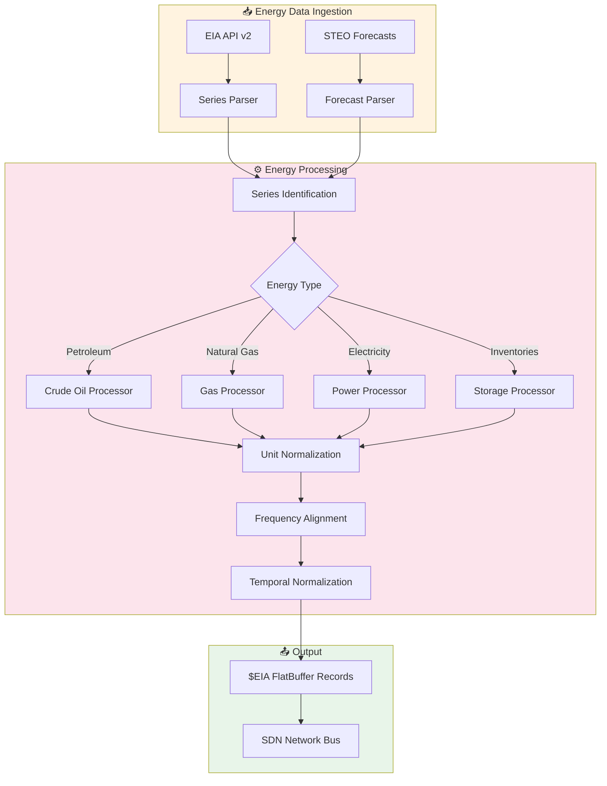

<](https://github.com/the-lobsternaut/eia-sdn-plugin/actions)
[](LICENSE)
[](https://github.com/the-lobsternaut/space-data-network)
[](#output-format)

**US Energy Information Administration** — WTI/Brent crude oil, natural gas, petroleum inventories, and energy market data from the US Department of Energy, compiled to WebAssembly for edge deployment.

---

## Overview

The US Energy Information Administration (EIA) collects, analyzes, and disseminates independent energy information covering all major energy sources and activities including production, consumption, trade, inventories, and prices. This plugin focuses on petroleum, natural gas, and key energy indicators critical for understanding energy security and launch propellant economics. Data is converted to FlatBuffers-aligned binary format.

### Why It Matters

- **Rocket propellant economics**: RP-1 (refined kerosene) pricing tracks crude oil markets
- **Launch cost modeling**: Energy prices directly affect manufacturing, transportation, and operations costs
- **Geopolitical risk correlation**: Oil supply disruptions signal geopolitical instability relevant to space operations
- **Energy security**: Petroleum reserve levels indicate national energy security posture
- **Infrastructure dependencies**: Satellite ground stations require reliable energy — grid stress matters

---

## Architecture


### Data Flow



---

## Data Sources & APIs

| Source | URL | Description |
|--------|-----|-------------|
| **EIA API v2** | https://api.eia.gov/v2/ | RESTful API for all energy data |
| **EIA API Docs** | https://www.eia.gov/opendata/documentation.php | API documentation |
| **Weekly Petroleum Status** | https://www.eia.gov/petroleum/supply/weekly/ | Weekly petroleum supply report |
| **STEO** | https://www.eia.gov/outlooks/steo/ | Short-Term Energy Outlook |
| **Natural Gas Weekly** | https://www.eia.gov/naturalgas/weekly/ | Natural gas storage report |

---

## Key Series Tracked

| Series ID | Name | Frequency | Unit |
|-----------|------|-----------|------|
| `PET.RWTC.D` | WTI Crude Oil Spot Price | Daily | $/barrel |
| `PET.RBRTE.D` | Brent Crude Oil Spot Price | Daily | $/barrel |
| `NG.RNGWHHD.D` | Henry Hub Natural Gas Spot | Daily | $/MMBtu |
| `PET.WCESTUS1.W` | US Crude Oil Stocks (excl. SPR) | Weekly | Thousand barrels |
| `PET.WCSSTUS1.W` | US Crude Oil Stocks (SPR) | Weekly | Thousand barrels |
| `PET.WGTSTUS1.W` | US Motor Gasoline Stocks | Weekly | Thousand barrels |
| `PET.WDISTUS1.W` | US Distillate Fuel Stocks | Weekly | Thousand barrels |
| `NG.NW2_EPG0_SWO_R48_BCF.W` | Lower 48 Natural Gas Storage | Weekly | Bcf |
| `ELEC.GEN.ALL-US-99.M` | US Total Electricity Generation | Monthly | MWh |
| `PET.MCRFPUS2.M` | US Crude Oil Production | Monthly | Thousand bbl/day |

---

## Research & References

- EIA (2024). ["API Technical Documentation"](https://www.eia.gov/opendata/documentation.php). US Energy Information Administration.
- EIA (2024). ["Annual Energy Outlook"](https://www.eia.gov/outlooks/aeo/). Long-term energy projections.
- Hamilton, J. D. (2009). ["Causes and Consequences of the Oil Shock of 2007-08"](https://doi.org/10.1353/eca.0.0047). *Brookings Papers on Economic Activity*, Spring 2009.
- IEA (2024). ["Oil Market Report"](https://www.iea.org/reports/oil-market-report-january-2024). International Energy Agency.
- OPEC: https://www.opec.org/opec_web/en/ — complementary oil market data

---

## Technical Details

### Energy Unit Conversions

| From | To | Factor |
|------|-----|--------|
| 1 barrel crude oil | 42 US gallons | × 42 |
| 1 barrel crude oil | ~5.8 MMBtu | × 5.8 |
| 1 MMBtu natural gas | ~1.038 Mcf | × 1.038 |
| 1 MWh electricity | 3.412 MMBtu | × 3.412 |

### Strategic Petroleum Reserve (SPR) Context

| Level | Status | Significance |
|-------|--------|-------------|
| > 600 M bbl | Full capacity | Maximum energy security |
| 400-600 M bbl | Normal | Standard reserve level |
| < 400 M bbl | **Depleted** | Emergency response capacity limited |

### Processing Pipeline

1. **JSON Ingestion** — Parse EIA API v2 series data responses
2. **Series Routing** — Categorize by energy type (petroleum, gas, power)
3. **Unit Normalization** — Convert to standard units ($/barrel, Bcf, MWh)
4. **Frequency Alignment** — Handle daily, weekly, monthly mixed frequencies
5. **Temporal Normalization** — Convert to Unix epoch seconds
6. **FlatBuffers Serialization** — Pack into `$EIA` aligned binary records

---

## Input/Output Format

### Input

JSON from the EIA API:

```json
{
  "response": {
    "data": [
      {
        "period": "2024-01-15",
        "value": 72.40,
        "seriesId": "PET.RWTC.D"
      }
    ]
  }
}
```

### Output

`$EIA` FlatBuffer-aligned binary records:

| Field | Type | Description |
|-------|------|-------------|
| `timestamp` | `float64` | Unix epoch seconds of observation |
| `latitude` | `float64` | 0.0 (national aggregate) |
| `longitude` | `float64` | 0.0 (national aggregate) |
| `value` | `float64` | Price, volume, or inventory level |
| `source_id` | `string` | EIA series ID |
| `category` | `string` | Energy type (petroleum/gas/power) |
| `description` | `string` | Series description and unit |

**File Identifier:** `$EIA`

---

## Build Instructions

### Quick Build

```bash
cd plugins/eia
./build.sh
```

### Manual Build

```bash
cd plugins/eia
git submodule update --init deps/emsdk
cd deps/emsdk && ./emsdk install latest && ./emsdk activate latest && cd ../..
source deps/emsdk/emsdk_env.sh
cd src/cpp && emcmake cmake -B build -S . && emmake make -C build
```

### Run Tests

```bash
cd src/cpp
cmake -B build -S . && cmake --build build && ctest --test-dir build
```

---

## Usage Examples

### Node.js

```javascript
import { SDNPlugin } from '@the-lobsternaut/sdn-plugin-sdk';

const plugin = await SDNPlugin.load('./wasm/node/eia.wasm');

const oil = await fetch(
  'https://api.eia.gov/v2/petroleum/pri/spt/data/?api_key=YOUR_KEY&data[]=value&facets[series][]=RWTC'
);
const result = plugin.parse(await oil.text());
console.log(`Parsed ${result.records} energy market observations`);
```

### C++ (Direct)

```cpp
#include "eia/types.h"

auto dataset = eia::parse_json(json_input);
for (const auto& obs : dataset.records) {
    printf("⛽ %s: $%.2f — %s\n",
           obs.source_id.c_str(), obs.value, obs.category.c_str());
}
```

---

## Dependencies

| Dependency | Version | Purpose |
|-----------|---------|---------|
| **Emscripten (emsdk)** | latest | C++ → WASM compilation |
| **CMake** | ≥ 3.14 | Build system |
| **FlatBuffers** | ≥ 23.5 | Binary serialization |
| **C++17** | — | Language standard |

---

## Plugin Manifest

```json
{
  "schemaVersion": 1,
  "name": "eia",
  "version": "0.1.0",
  "description": "US Energy Information Administration. Parses WTI/Brent crude, natural gas, inventories",
  "author": "DigitalArsenal",
  "license": "Apache-2.0",
  "inputFormats": ["application/json"],
  "outputFormats": ["$EIA"],
  "dataSources": [
    {
      "name": "eia",
      "url": "https://api.eia.gov/",
      "type": "REST",
      "auth": "api_key (optional)"
    }
  ]
}
```

---

## Project Structure

```
plugins/eia/
├── README.md
├── build.sh
├── plugin-manifest.json
├── deps/
│   └── emsdk/
├── src/cpp/
│   ├── CMakeLists.txt
│   ├── include/eia/
│   │   └── types.h
│   ├── src/
│   │   └── eia.cpp
│   ├── tests/
│   │   └── test_eia.cpp
│   └── wasm_api.cpp
└── wasm/
    └── node/
```

---

## License

This project is licensed under the [Apache License 2.0](https://www.apache.org/licenses/LICENSE-2.0).

---

## Related Plugins

- [`fred`](../fred/) — Federal Reserve Economic Data
- [`yfinance`](../yfinance/) — Yahoo Finance live market prices
- [`bls`](../bls/) — Bureau of Labor Statistics

---

*Part of the [Space Data Network](https://github.com/the-lobsternaut/space-data-network) plugin ecosystem.*
]]>